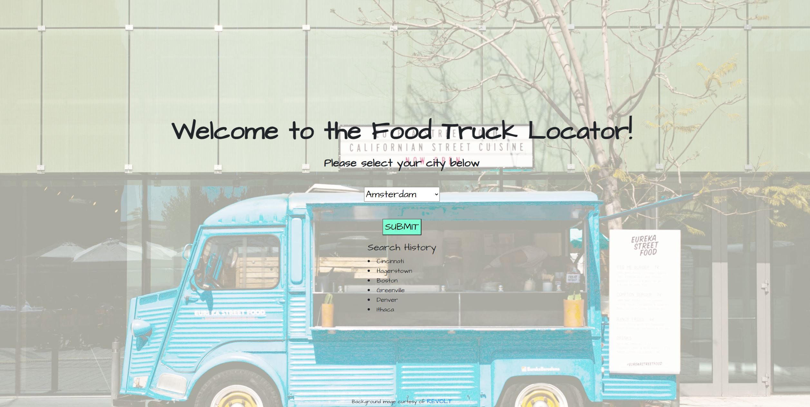
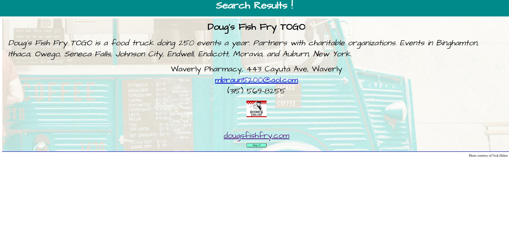

# <Food Truck Locator>

## Description

We are motivated by our love of food!. We love to eat the delicious food from food trucks, but have always found it very difficult to find the exact locations of them. We built this project in hope to solve this problem and help people find the food truck they so often crave. We learned that working with APIs can be very difficult because data is money so it is tough to find one for free.

## Technologies Used

1. HTML
2. CSS
3. Javascript
4. Bootstrap

## Installation

The installation simply requires opening a webpage.

## Usage

https://rgeisreiter.github.io/FoodTruckLocator/

When the user visits the site, they are presented with an option to select their city of choice. Upon doing so, they are redirected to another page where a food truck list for the selected city will be displayed along with the option display the location of the food truck in a map.

## Important - Read Before Launching the Application

Because of the API security setup, we are using a proxy server to pull the data from the source. This can cause an error When you run the site for the first time, because the proxy server requires permission for use. The site to request permission for use is presented in the console with the error. All that is needed is to access the URL shown and request and click on the button to request use permission. With that, the application should run without any errors upon refresh.

## APIs used:

1. https://cors-anywhere.herokuapp.com/http://data.streetfoodapp.com/1.1/regions/
2. https://api.mapbox.com/mapbox-gl-js/v2.2.0/mapbox-gl.js

## License

Attribution — You must give appropriate credit, provide a link to the license, and indicate if changes were made. You may do so in any reasonable manner, but not in any way that suggests the licensor endorses you or your use.

NonCommercial — You may not use the material for commercial purposes.

No additional restrictions — You may not apply legal terms or technological measures that legally restrict others from doing anything the license permits.
